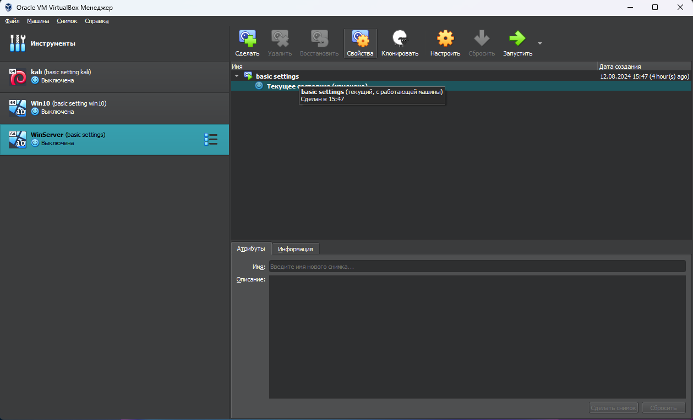
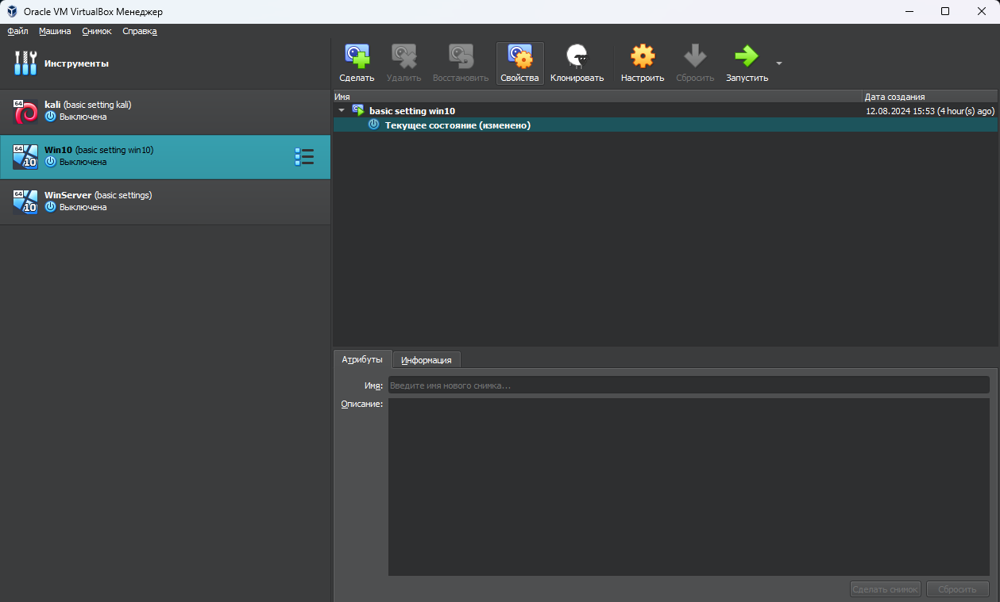
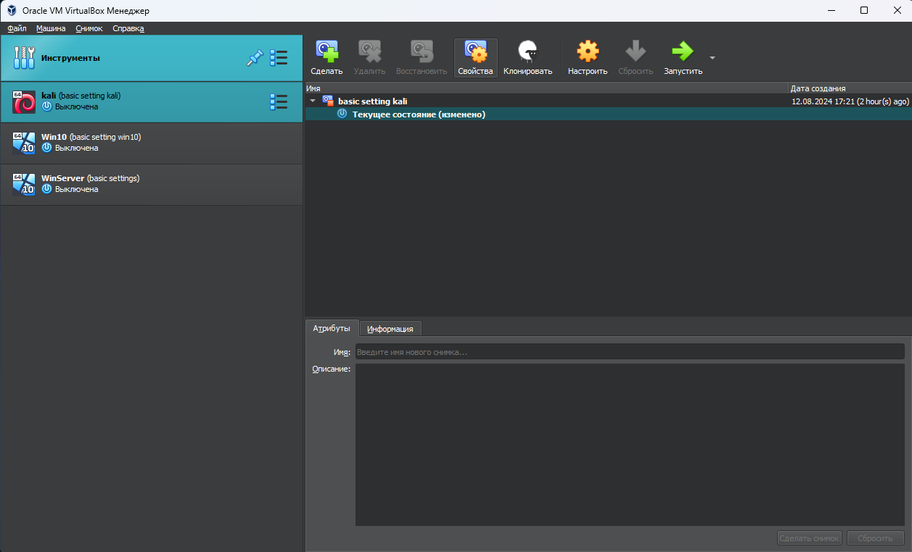
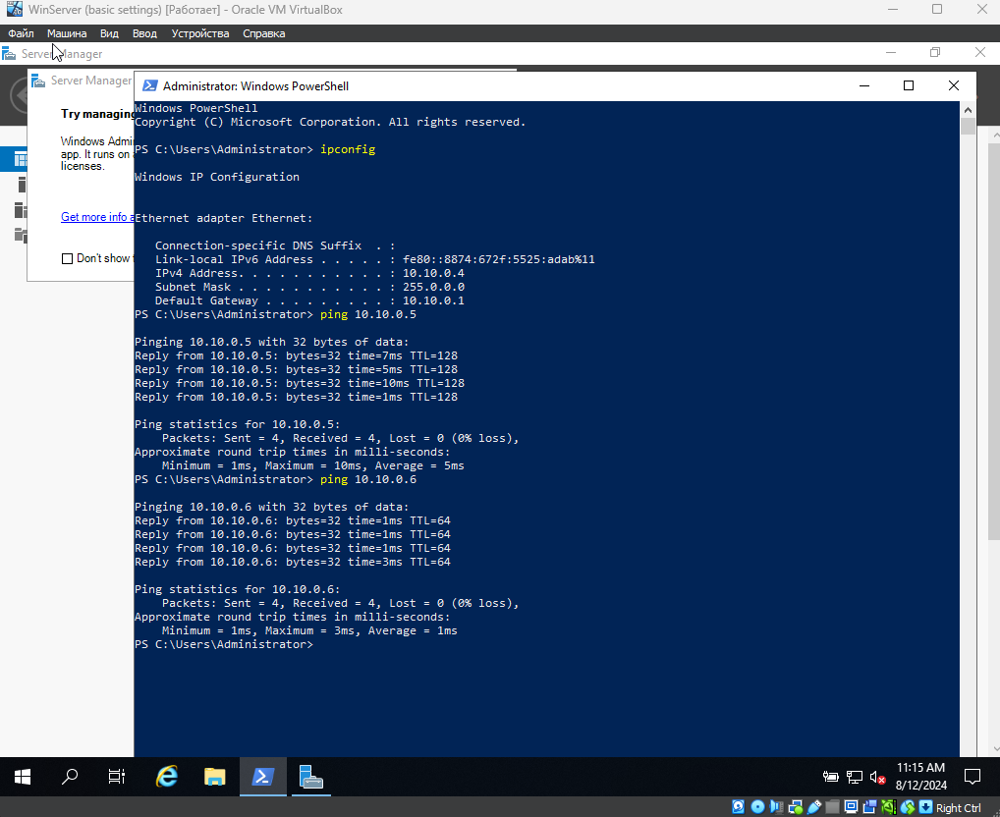
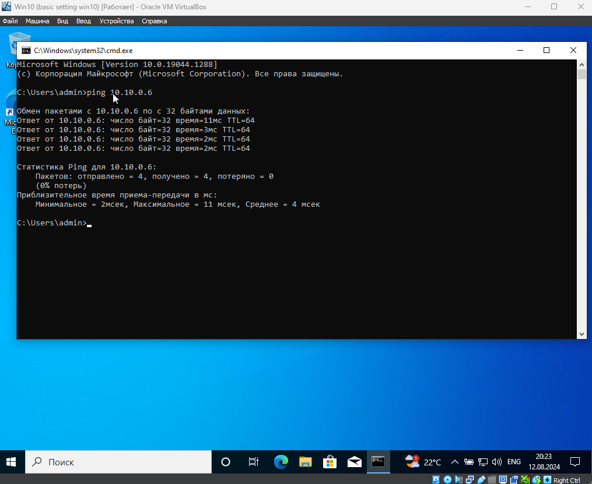
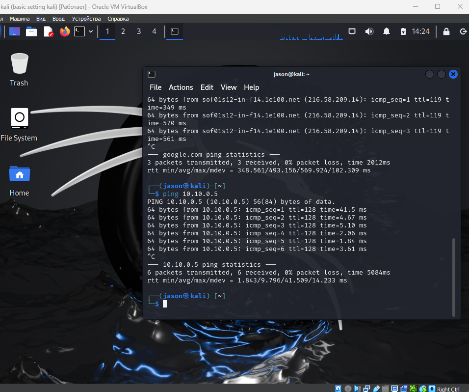
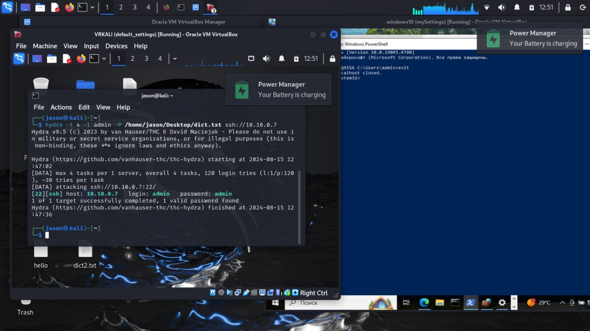
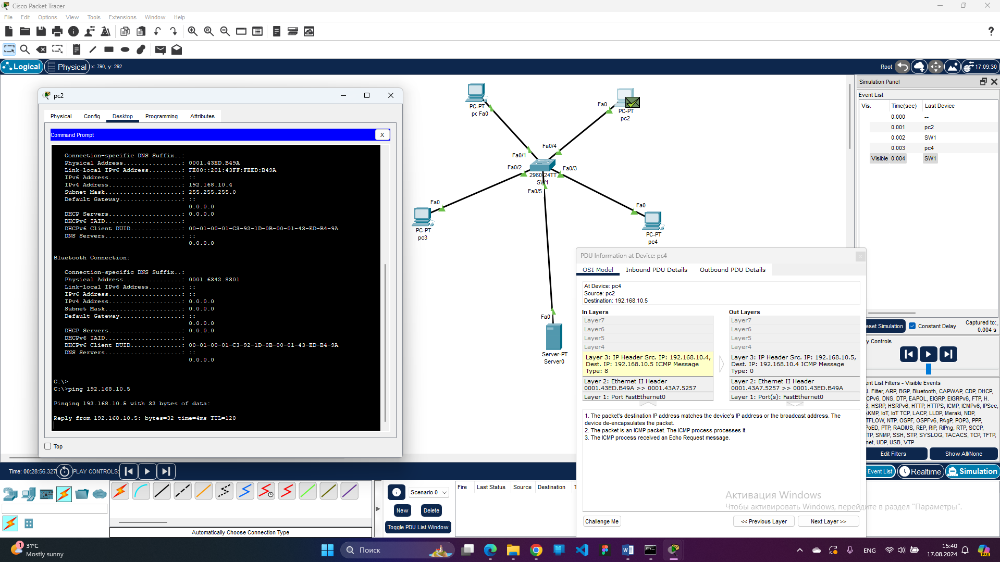

# Cybersecurity
**TeachMeSkills**

## LESSON 1

_Introduction_

## LESSON 2

    
    
    
    
    
    

## LESSON 3

    

## LESSON 4

**Модель OSI: Семь уровней**
1. <h3 color="Red"> Физический уровень (Physical Layer) </h3>

    - Функция: Определяет физические и электрические характеристики соединения.
    - Примеры: Кабели, разъемы, электрические сигналы, оптоволоконные линии.
    - Протоколы/Технологии: Ethernet (физические аспекты), USB, DSL.

2. Канальный уровень (Data Link Layer)

    - Функция: Обеспечивает передачу данных между узлами в одной сети, устраняет ошибки, контролирует доступ к среде передачи.
    - Примеры: MAC-адреса, коммутаторы (Switches).
    - Протоколы: Ethernet, Wi-Fi, PPP (Point-to-Point Protocol).

3. Сетевой уровень (Network Layer)

    - Функция: Маршрутизация пакетов данных между разными сетями, определение пути передачи данных.
    - Примеры: IP-адреса, маршрутизаторы (Routers).
    - Протоколы: IP (Internet Protocol), ICMP (Internet Control Message Protocol).

4. Транспортный уровень (Transport Layer)

    - Функция: Обеспечивает надежную передачу данных, управление сессиями передачи, контроль ошибок.
    - Примеры: Порты TCP/UDP.
    - Протоколы: TCP (Transmission Control Protocol), UDP (User Datagram Protocol).

5. Сеансовый уровень (Session Layer)

    - Функция: Управляет установкой, поддержанием и завершением сеансов связи между приложениями.
    - Примеры: Сеансы данных, управление диалогами.
    - Протоколы: PPTP (Point-to-Point Tunneling Protocol), RPC (Remote Procedure Call).

6. Представительский уровень (Presentation Layer)

    - Функция: Обеспечивает преобразование данных между форматами, шифрование и дешифрование, сжатие данных.
    - Примеры: Форматы данных, шифрование SSL/TLS.
    - Протоколы: JPEG, GIF, SSL/TLS.

7. Прикладной уровень (Application Layer)

    - Функция: Предоставляет интерфейс и услуги для приложений, обеспечивая доступ к сетевым ресурсам.
    - Примеры: Веб-браузеры, почтовые клиенты.
    - Протоколы: HTTP, FTP, SMTP, DNS.
--------------
(OSI model)

- А (Application) — Прикладной
- П (Presentation) — Представительский
- С (Session) — Сеансовый
- Т (Transport) — Транспортный
- С (Network) — Сетевой
- К (Data Link) — Канальный
- Ф (Physical) — Физический

------------

**Атаки OSI**

1. Физический уровень (Physical Layer)
_Атаки:_

    - Перехват данных (Wiretapping): Физическое подключение к кабелю для прослушивания передаваемых данных.
    - Помехи (Interference): Использование электромагнитных помех для нарушения работы сети.
    - Физическое повреждение (Physical Damage): Нарушение работы сети путем повреждения оборудования или кабелей.
>
2. Канальный уровень (Data Link Layer)
_Атаки:_

    - MAC-спуфинг (MAC Spoofing): Подмена MAC-адреса для получения несанкционированного доступа к сети.
    - Атака "Человек посередине" (Man-in-the-Middle, MITM): Перехват и изменение трафика между двумя устройствами.
    - Атака "Петля" (Loop Attack): Создание петли в сети, что может привести к перегрузке сети и отказу в обслуживании.
>
3. Сетевой уровень (Network Layer)
_Атаки:_

    - IP-спуфинг (IP Spoofing): Подмена IP-адреса для маскировки источника атаки.
    - DDoS (Distributed Denial of Service): Перегрузка сети огромным количеством трафика, чтобы вызвать отказ в обслуживании.
    - Маршрутизационное отравление (Routing Table Poisoning): Внесение ложных записей в таблицы маршрутизации, что приводит к перенаправлению трафика через узлы злоумышленника.
>
4. Транспортный уровень (Transport Layer)
_Атаки:_

    - Сканирование портов (Port Scanning): Изучение открытых портов на устройстве для выявления уязвимостей.
    - Атака SYN Flood: Перегрузка сервера большим количеством недозавершенных запросов SYN, что приводит к отказу в обслуживании.
    - TCP-сессии перехват (TCP Session Hijacking): Захват активной TCP-сессии для перехвата данных или выполнения команд от имени пользователя.
>
5. Сеансовый уровень (Session Layer)
_Атаки:_

    - Угон сессии (Session Hijacking): Перехват активной сессии между клиентом и сервером для получения несанкционированного доступа.
    - Повторная атака (Replay Attack): Повторное воспроизведение ранее перехваченных сообщений для выполнения несанкционированных действий.
>
6. Представительский уровень (Presentation Layer)
_Атаки:_

    - Эксплойты уязвимостей форматов данных (Data Format Exploits): Использование уязвимостей в форматах данных (например, изображений или видео) для выполнения вредоносного кода.
    - Атака на шифрование (Cryptographic Attack): Попытки взлома или обхода методов шифрования, например, атаки на SSL/TLS.
>
7. Прикладной уровень (Application Layer)
_Атаки:_

    - SQL-инъекция (SQL Injection): Внедрение вредоносного SQL-кода через веб-формы для выполнения нежелательных действий с базой данных.
    - XSS (Cross-Site Scripting): Внедрение вредоносного кода в веб-страницы для выполнения его в браузерах пользователей.
    - Фишинг (Phishing): Мошенничество, направленное на получение конфиденциальной информации (например, паролей) путем обмана пользователей.

## LESSON 5

    

