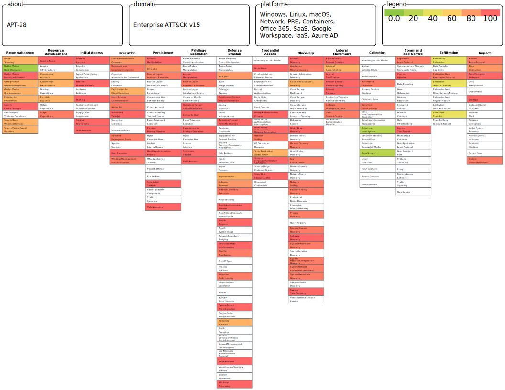

# Mitre Attack



<p><h5>APT28</h5> 
(известная также как Fancy Bear, Sofacy, STRONTIUM и другими именами) — это продвинутая постоянная угроза (APT), которая, как считается, связана с российскими государственными структурами. Эта группировка специализируется на шпионаже, информационных атаках и операциях по взлому и утечке данных. Чтобы противодействовать атакам со стороны APT28, можно разработать план защиты на основе MITRE ATT&CK, который включает в себя применение различных тактик и техник для выявления, защиты и реагирования на атаки.</p>

--------

### План защиты на основе MITRE ATT&CK для противодействия APT28

<h3>1. Оперативная разведка (Reconnaissance)</h3>

- Тактика: 

```
Сбор информации о целевой системе и пользователях.
```

- Техники, используемые APT28:

```
T1592: Сбор информации об инфраструктуре (злоумышленники могут собирать информацию о доменах и сетевой инфраструктуре).
T1595: Активное сканирование (сканирование сети для поиска открытых портов и уязвимостей).
```

- Меры защиты:

```
Внедрение механизмов мониторинга и анализа сетевого трафика (например, NTA — Network Traffic Analysis).
Регулярное проведение тестов на уязвимости и сканирования сетевой инфраструктуры.
Отключение открытых портов и ограничение публичного доступа к критическим службам.
Использование межсетевых экранов и IDS/IPS для предотвращения несанкционированных попыток сканирования.
```

------

<h3>2. Первичный доступ (Initial Access)</h3>

- Тактика:

```
Получение доступа к целевой сети.
```

- Техники, используемые APT28:

```

T1566: Фишинг (APT28 использует целевые фишинговые письма для получения учетных данных).
T1078: Использование скомпрометированных учетных данных (получение учетных данных через фишинг или брутфорс).
```

Меры защиты:

```
Обучение сотрудников распознаванию фишинговых атак.
Внедрение многофакторной аутентификации (MFA).
Регулярное изменение паролей и использование надежных политик управления паролями.
Мониторинг логов аутентификации для выявления подозрительных входов в систему.
```

-------

<h3>3. Использование вредоносных программ (Execution)</h3>

- Тактика: 

```
Выполнение вредоносных программ на целевых системах.
```

- Техники, используемые APT28:

```
T1059: Командная строка и сценарии (использование PowerShell и других инструментов для выполнения команд).
T1204: Эксплуатация пользовательских ошибок (злоупотребление доверчивостью пользователей для запуска вредоносных файлов).
```

- Меры защиты:

```
Внедрение механизмов блокировки выполнения скриптов (например, AppLocker или PowerShell Constrained Language Mode).
Использование антивирусных решений с функциями обнаружения и блокировки вредоносного кода.
Ограничение прав пользователей на выполнение команд через командную строку.
Обновление и патчинг систем и приложений для устранения уязвимостей.
```

-------

<h3>4. Укрепление доступа (Persistence)</h3>

- Тактика: 

```
Обеспечение постоянного присутствия в скомпрометированной системе.
```

- Техники, используемые APT28:

```
T1547: Модификация автозагрузки (APT28 часто модифицирует системные автозагрузки).
T1053: Запланированные задачи (злоумышленники могут использовать планировщик задач для постоянного выполнения вредоносных программ).
```

- Меры защиты:
```
Контроль доступа к системным файлам и папкам с помощью ограничений на выполнение задач от имени администратора.
Мониторинг запланированных задач и процессов, а также системных изменений в автозагрузке.
Регулярное проведение инвентаризации активных процессов и служб.
```
--------

<h3>5. Повышение привилегий (Privilege Escalation)</h3>

- Тактика: 
```
Получение прав администратора на целевой системе.
```
- Техники, используемые APT28:

```
T1068: Эксплуатация уязвимостей в операционной системе (APT28 может использовать уязвимости ОС для повышения привилегий).
T1078: Использование учетных данных администратора.
```

- Меры защиты:

```
Ограничение использования учетных записей с правами администратора и мониторинг их активности.
Использование инструмента управления патчами для быстрого закрытия уязвимостей в операционных системах и приложениях.
Внедрение привилегированных решений для управления учетными данными (PAM — Privileged Access Management).
```

--------

<h3>6. Сбор данных (Collection)</h3>
- Тактика: 

```
Сбор данных с скомпрометированных систем для их дальнейшей эксфильтрации.
```

- Техники, используемые APT28:

```
T1005: Сбор данных с локальных систем.
T1074: Запись и сжатие данных перед эксфильтрацией.
```

- Меры защиты:

```
Внедрение шифрования данных на рабочих станциях и серверах.
Контроль доступа к конфиденциальным файлам и данным на основе принципа минимальных прав.
Мониторинг систем на наличие операций сжатия данных и подозрительных архивов.
```

-------

<h3>7. Экфильтрация данных (Exfiltration)</h3>
- Тактика: 

```
Передача скомпрометированных данных за пределы целевой сети.
```

- Техники, используемые APT28:

```
T1041: Экфильтрация через каналы команд и контроля (передача данных через C2-сервера).
T1029: Зашифрованные каналы эксфильтрации (использование шифрования для маскировки данных при передаче).
```

- Меры защиты:

```
Настройка сетевых фильтров для блокировки подозрительных соединений.
Мониторинг и ограничение сетевого трафика по аномалиям (например, массовая передача данных).
Использование DLP (Data Loss Prevention) для предотвращения утечек данных.
```

---------

<h3>8. Командование и управление (C2 — Command and Control)</h3>

- Тактика: 
```
Управление скомпрометированной сетью и системами с помощью команд и контроля.
```

- Техники, используемые APT28:

```
T1105: Удаленная передача файлов (передача вредоносных файлов через C2-серверы).
T1071: Использование зашифрованных каналов связи.
```

- Меры защиты:

```
Ограничение выходящих соединений и фильтрация трафика через прокси-серверы.
Использование систем обнаружения аномалий и анализа сетевого трафика (например, Zeek или Suricata).
Внедрение технологий блокировки доступа к известным C2-серверам (например, через Threat Intelligence-подписки).
```

-------

<h3>9. Осложнение расследования (Defense Evasion)</h3>

- Тактика: 

```
Маскировка активности злоумышленников и затруднение обнаружения.
```

- Техники, используемые APT28:

```
T1070: Удаление логов (APT28 может удалять системные логи для скрытия своей активности).
T1218: Злоупотребление разрешенными программами (использование легитимных инструментов для выполнения вредоносных задач).
```

- Меры защиты:

```
Централизованный сбор и защита логов с помощью SIEM-систем (например, Splunk, ELK).
Внедрение механизмов защиты логов от удаления и изменений.
Мониторинг использования легитимных программ для аномальной активности.
```

--------

Заключение:

Этот план защиты от атак APT28 на основе MITRE ATT&CK фокусируется на предотвращении основных тактик и техник, используемых этой группировкой, с целью повышения уровня безопасности. Систематический мониторинг, контроль и приведение инфраструктуры в соответствие с передовыми методами защиты поможет значительно снизить риски от атакAPT28.