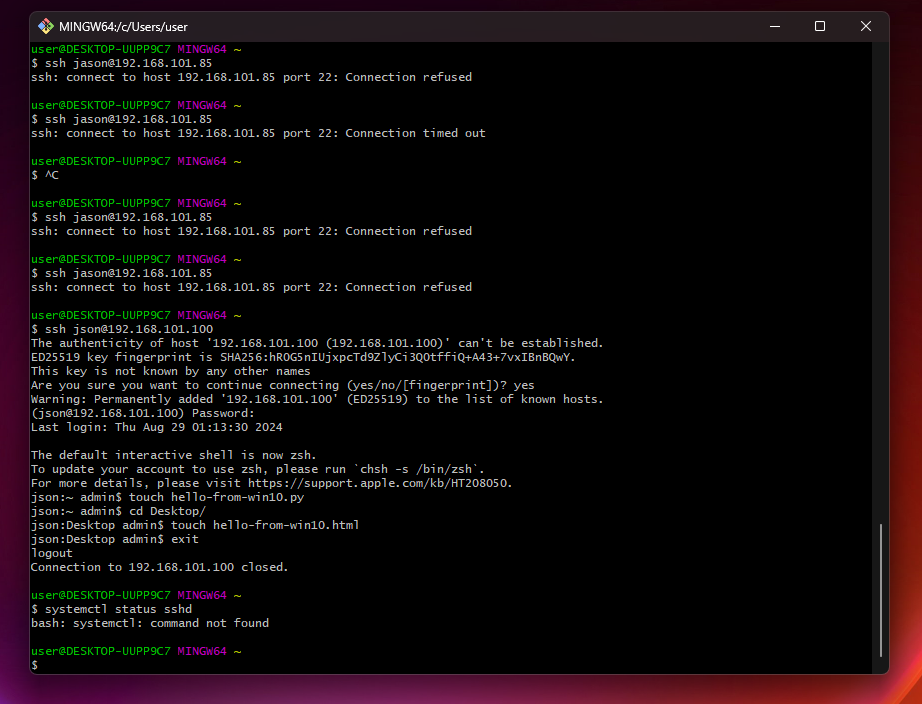
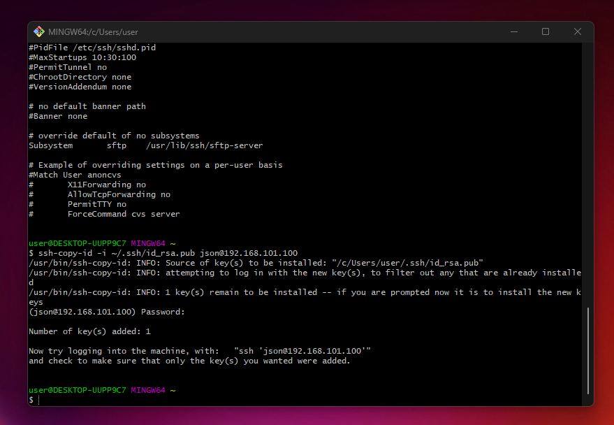
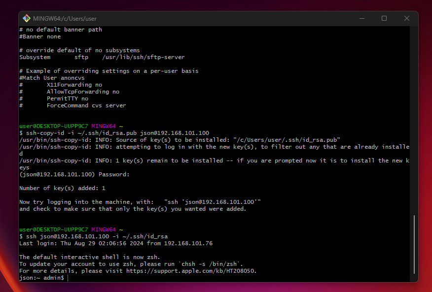
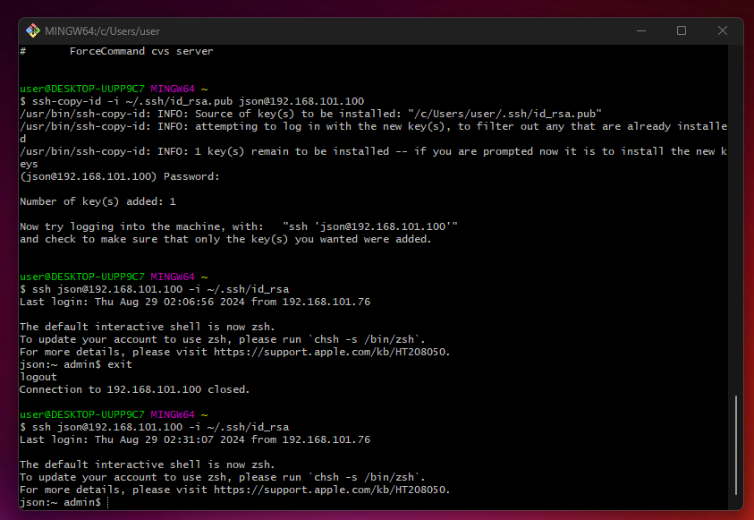

## LESSON 6

IPSec (Internet Protocol Security) — это фреймворк, обеспечивающий безопасность на уровне сетевого протокола, который широко используется для защиты передаваемых данных через Интернет. Он включает различные этапы, методы и протоколы для установления безопасного соединения между двумя узлами. 

Компоненты: 
- IKE (Internet Key Exchange)
- Протоколы IPSec
- HTTP и HTTPS

--------

<h3>IKE Phase 1</h3>
Цель первого этапа IKE — создать защищенный канал связи между двумя узлами для обмена ключами и другой конфиденциальной информацией.

##### Этапы IKE Phase 1:

_Аутентификация и обмен ключами:_ 
На этом этапе используются методы аутентификации (например, предустановленные ключи (Pre-Shared Key, PSK), цифровые сертификаты или RSA).
_Выработка SA (Security Association):_
Это соглашение о параметрах безопасности, которые будут использоваться на последующих этапах.
_Параметры шифрования:_
Выбор алгоритмов шифрования и хеширования (например, AES, SHA) для обеспечения конфиденциальности и целостности данных.
_Методы аутентификации:_ 
IKE Phase 1 поддерживает такие методы аутентификации, как RSA цифровые подписи, PSK или использование сертификатов.

Режимы IKE Phase 1:

- Main Mode: Более безопасный режим, в котором обмен сообщениями разбит на 6 шагов, обеспечивая защиту идентификации узлов.
- Aggressive Mode: Быстрее, так как включает всего 3 шага, но менее безопасен, так как аутентификация узлов может быть выполнена до завершения обмена.

---------
 
<h3>IKE Phase 2</h3>
Цель второго этапа IKE — установить и поддерживать IPSec SA для защиты данных, передаваемых между узлами.

##### Этапы IKE Phase 2:

_Установление IPSec SA:_ 
На этом этапе устанавливаются параметры безопасности для защиты данных, такие как алгоритмы шифрования и хеширования, которые будут использоваться для шифрования трафика.
_Выбор режимов работы:_ 
Обычно используется один из двух режимов — транспортный или туннельный.
_Обмен ключами:_ 
Происходит обмен ключами, которые будут использоваться для шифрования и аутентификации передаваемых данных.
_Quick Mode:_ 
Используется для быстрого обмена информацией, обеспечивая защиту трафика с помощью параметров, согласованных на этапе IKE Phase 1.

---------

<h3>IPSec Framework Protocols</h3>
IPSec использует набор протоколов для обеспечения безопасности на уровне сети. 

Основные протоколы:

- AH (Authentication Header): Обеспечивает целостность и аутентификацию данных, но не обеспечивает шифрование. Используется для защиты от атак, таких как подмена данных.

- ESP (Encapsulating Security Payload): Обеспечивает конфиденциальность, целостность и аутентификацию данных. В отличие от AH, ESP поддерживает шифрование данных, что делает его более универсальным для защиты сетевого трафика.

- SA (Security Association): Логическое соединение, которое определяет параметры безопасности, такие как алгоритмы шифрования, хеширования и ключи, используемые для защиты данных.

-----------

<h3>HTTP vs HTTPS</h3>
HTTP (Hypertext Transfer Protocol) и HTTPS (Hypertext Transfer Protocol Secure) — это два протокола, используемые для передачи данных между веб-браузером и сервером, но они различаются уровнем безопасности.

##### HTTP:

- Не обеспечивает шифрование передаваемых данных.
Уязвим к атакам, таким как перехват трафика и подмена данных.
Используется для передачи неконфиденциальной информации.

##### HTTPS:

- Обеспечивает шифрование передаваемых данных с использованием SSL/TLS протоколов.
- Защищает данные от перехвата и подмены.
- Используется для передачи конфиденциальной информации, такой как пароли, финансовые данные и личная информация.
- Содержит цифровой сертификат, подтверждающий подлинность веб-сайта.

<h2>SSH</h2>

