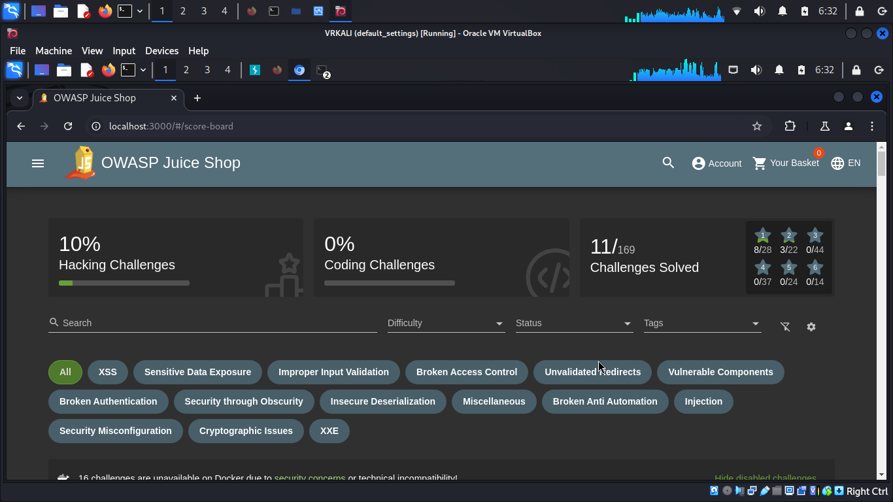

#### Спуфинг (Spoofing) 
- это форма кибератаки, при которой злоумышленник подделывает свои идентификационные данные, чтобы выдать себя за другого пользователя, устройство или сервис. Цель таких атак — обмануть системы безопасности, украсть данные, получить несанкционированный доступ или нарушить работу систем. Существуют различные типы спуфинга, и для каждого из них существуют определенные средства и методы защиты.

<h3>Основные типы спуфинга:</h3>

--------

- IP Spoofing (Подмена IP-адреса)

<h5>Описание:</h5> 
Злоумышленник изменяет IP-адрес пакета данных, чтобы скрыть свою личность или создать видимость, что пакет исходит от доверенного узла.
<h5>Цели:</h5> 
Сетевые атаки, такие как DDoS, обход межсетевых экранов (firewall) или обман систем обнаружения вторжений (IDS).
<h5>Средства защиты:</h5>
Использование фильтрации на основе IP-адресов (IP Filtering) и межсетевых экранов (firewall).
Настройка систем обнаружения аномалий в сетевом трафике (IDS/IPS).
Включение методов проверки целостности и подлинности данных.

--------

- ARP Spoofing (Подмена ARP)

<h5>Описание:</h5> 
Злоумышленник отправляет ложные сообщения ARP (Address Resolution Protocol) в локальную сеть, чтобы изменить таблицы ARP других устройств. Это позволяет перенаправлять трафик через устройство злоумышленника.
<h5>Цели:</h5>
Перехват данных, атаки «человек посередине» (MITM), кража информации.
<h5>Средства защиты:</h5>
Использование статических записей ARP, где это возможно.
Внедрение динамической защиты ARP, такой как Dynamic ARP Inspection (DAI) на коммутаторах.
Использование инструментов для обнаружения аномальной активности в сети.

--------

- DNS Spoofing (Подмена DNS)

<h5>Описание:</h5> Злоумышленник изменяет записи DNS-сервера или отвечает на DNS-запросы поддельными данными, перенаправляя пользователей на вредоносные сайты.
<h5>Цели:</h5> Перенаправление пользователей на фальшивые веб-сайты для фишинга, установка вредоносного ПО, кража данных.
<h5>Средства защиты:</h5>
Использование DNSSEC (расширений безопасности DNS) для проверки подлинности записей DNS.
Настройка фильтрации DNS-запросов и внедрение контроля доступа.
Использование систем обнаружения и предотвращения вторжений для мониторинга и защиты DNS-трафика.

--------

- Email Spoofing (Подмена электронной почты)

<h5>Описание:</h5> 
Злоумышленник подделывает адрес отправителя в электронном письме, чтобы письмо казалось отправленным от доверенного источника.
<h5>Цели:</h5> 
Фишинг, распространение вредоносного ПО, мошенничество.
<h5>Средства защиты:</h5>
Внедрение протоколов аутентификации электронной почты, таких как SPF (Sender Policy Framework), DKIM (DomainKeys Identified Mail) и DMARC (Domain-based Message Authentication, Reporting, and Conformance).
Использование фильтров спама и антифишинговых инструментов.
Обучение пользователей распознавать фальшивые письма.

---------

- GPS Spoofing (Подмена сигнала GPS)

<h5>Описание:</h5> 
Злоумышленник передает поддельные GPS-сигналы, чтобы обмануть устройства, принимающие эти сигналы, и заставить их определять неверное местоположение.
<h5>Цели:</h5> 
Нарушение работы навигационных систем, кража транспорта, нарушение военных операций.
<h5>Средства защиты:</h5>
Использование многочастотных приемников GPS, которые могут обнаруживать аномалии в сигналах.
Внедрение методов аутентификации GPS-сигналов.
Применение альтернативных систем навигации и отслеживания в качестве резервного варианта.

--------

- Caller ID Spoofing (Подмена номера телефона)

<h5>Описание:</h5> Злоумышленник изменяет отображаемый номер телефона на экране получателя, чтобы казаться доверенным лицом или организацией.
<h5>Цели:</h5> 
Социальная инженерия, мошенничество, фишинг.
<h5>Средства защиты:</h5>
Внедрение технологий аутентификации звонков, таких как STIR/SHAKEN.
Использование блокировки вызовов и идентификации спама.
Обучение пользователей не доверять звонкам с неизвестных или подозрительных номеров.

------

#### Заключение
Спуфинг является серьезной угрозой для информационной безопасности, так как может приводить к утечке данных, нарушению работы систем и финансовым потерям. Для защиты от спуфинга необходимо применять комплексный подход, включающий технические средства защиты, такие как фильтрация, мониторинг и аутентификация, а также обучать пользователей основам кибербезопасности.

--------

OWASP Juice Shop

